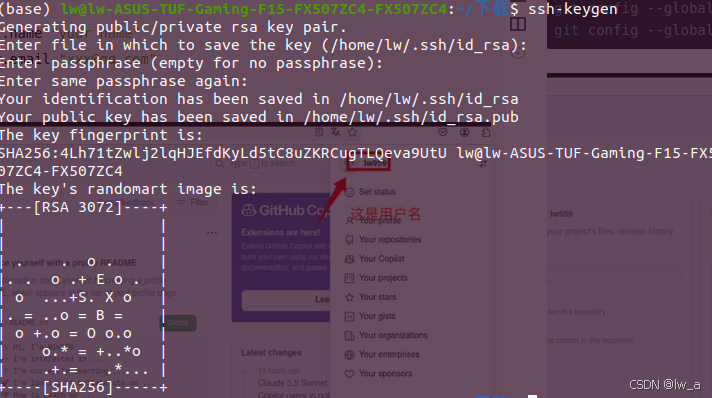
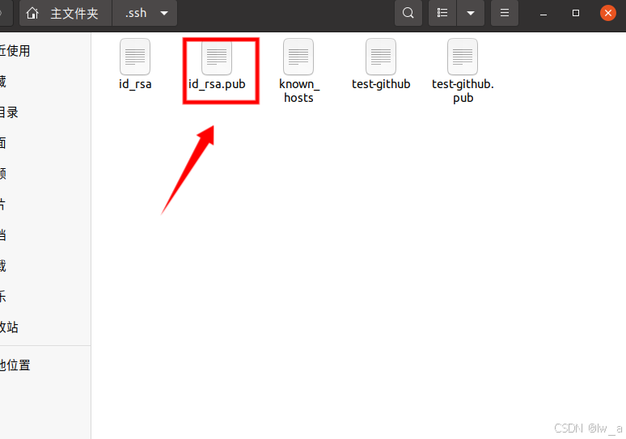
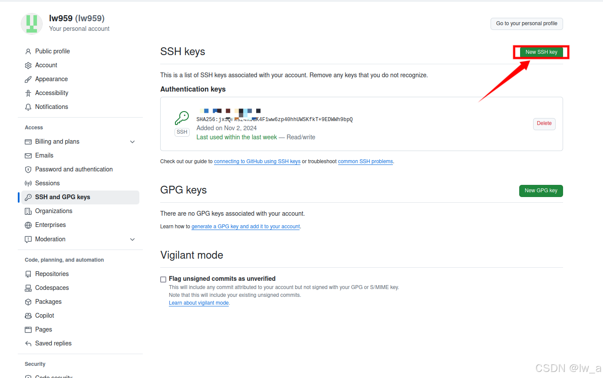
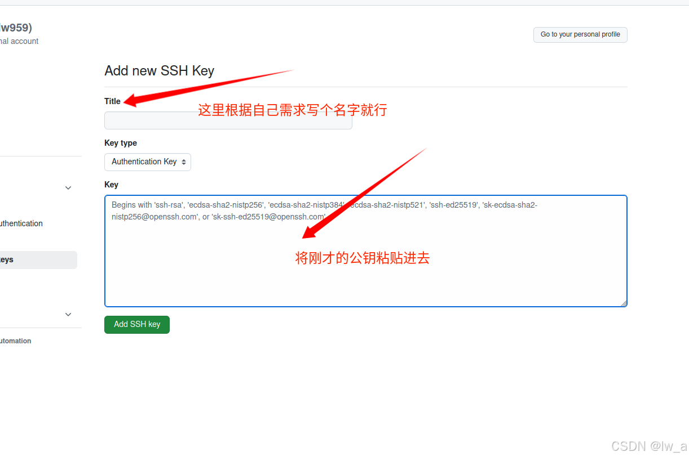
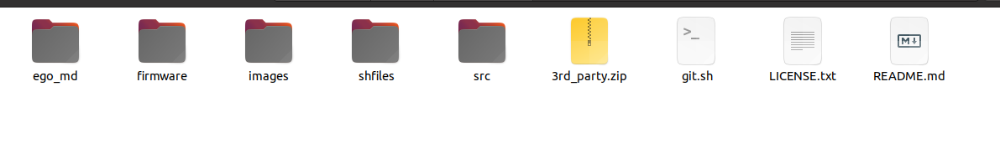

# ubuntu使用github上传自己的代码

## 1.创建自己的代码库

在这个界面根据自己的需求设置代码库名称等细节然后点击右下角绿色键


## 2.其他工作

如果你是第一次上传git代码请配置你的用户名和邮箱

```
git config --global user.name "your name"
git config --global user.email "xxx@qq.com"
```

配置密钥

ssh-keygen

输入之后一直回车就好


出现这个画面就是成功了
按Ctrl + H显示ubuntu的隐藏文件 找到 .ssh

点进去


这个.pub文件就是我们需要的公钥，没有pub的是私钥这里不需要使用
点进去



复制它按下面流程操作






到这里之后就可以开始上传代码了

## 3.上传代码

将脚本git.sh放到要上传的代码同一级目录下，如图：



然后在该目录下打开终端，执行指令：

```
bash git.sh
```

后续就可以按照脚本进行相关信息的填写了
